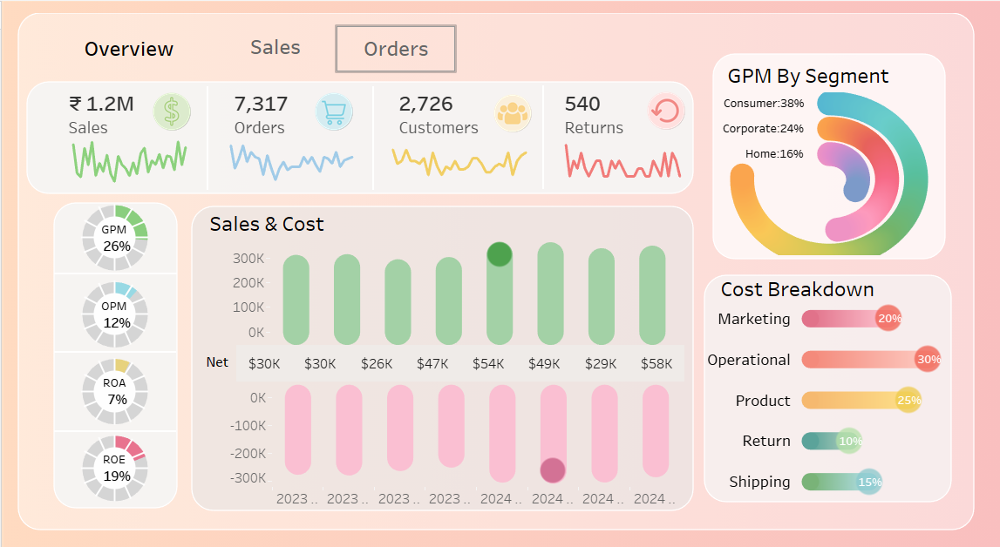

# 📊 Sales & Orders Dashboard | Tableau

## 📌 Project Overview

This Tableau dashboard provides an interactive analysis of sales performance, orders, customers, returns, and cost breakdown.

It helps businesses track KPIs, profitability, and operational efficiency.

---

## 🛠 Tools Used

- Tableau Desktop
- Data Visualization
- Business Intelligence
- Dashboard Design

---

## 📈 Key Metrics

- Total Sales: ₹1.2M
- Total Orders: 7,317
- Total Customers: 2,726
- Total Returns: 540

Profitability Metrics:

- GPM: 26%
- OPM: 12%
- ROA: 7%
- ROE: 19%

---

## 📷 Dashboard Preview

---

## 📊 Dashboard Features

- Sales Trend Analysis
- Customer Analysis
- Cost Breakdown
- Profitability Analysis
- Segment-wise Performance

---

## 📂 Tableau File

You can download the Tableau file from this repository:

Sales & Orders Dashboard Tableau.twb

---

## 🎯 Skills Demonstrated

- Tableau Dashboard Development
- Business Data Analysis
- KPI Monitoring
- Interactive Visualization
- Data Storytelling

---

## 👩‍💻 Author

Nida Dabir

Data Science Student  
Power BI | Tableau | Python | Machine Learning

